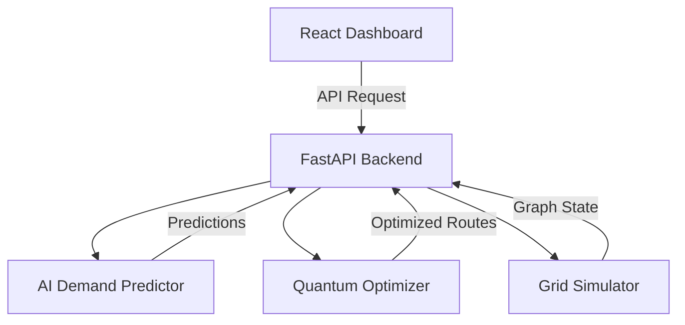

# AI + Quantum Smart Energy Grid Optimizer

[](https://www.python.org/)
[](https://fastapi.tiangolo.com/)
[](https://reactjs.org/)
[](https://tailwindcss.com/)
[](https://qiskit.org/)
[](https://opensource.org/licenses/MIT)

> **Predicting the future of energy with AI and optimizing distribution with Quantum-inspired algorithms.**

This full-stack system provides a real-time dashboard to monitor a simulated power grid. It leverages **Random Forest Regressors** for precise load forecasting and **Qiskit-based Quantum optimization** to prevent grid failures by intelligently rerouting power during peak demand.

---

## Project Architecture



- **`backend/`**: Python core powered by FastAPI, Scikit-learn, and Qiskit.
- **`frontend/`**: Modern React SPA using Vite, Tailwind CSS, and Framer Motion.
- **`scripts/`**: Utility scripts for synthetic data generation and model training.

---

## Key Features

- **AI Load Forecasting**: Predictive modeling based on hour, temperature, and historical patterns.
- **Quantum Optimization**: Conceptual QAOA-style routing to balance substation loads in real-time.
- **Dynamic Visualization**: Live 2D force-directed graph of the grid with particle-flow animations.
- **Responsive Dashboard**: Premium dark-mode UI with glassmorphic cards and interactive simulation controls.
- **Decision Engine**: Automated status categorization (Normal, Shift Load, Critical) with data-driven explanations.

---

## Getting Started

### Prerequisites

- **Node.js**: v18 or later
- **Python**: v3.10 or later
- **Virtual Environment**: Recommended (venv or conda)

### 1. Backend Installation

```bash
# Navigate to project root
cd energy-grid-ai

# Setup Virtual Environment
python -m venv venv
.\venv\Scripts\activate  # Windows
# source venv/bin/activate # Linux/Mac

# Install dependencies
pip install -r backend/requirements.txt

# Start the server
cd backend
uvicorn main:app --reload
```
> [!TIP]
> Access the interactive API documentation at `http://localhost:8000/docs`.

### 2. Frontend Installation

```bash
# Open a new terminal
cd frontend

# Install packages
npm install

# Run dev server
npm run dev
```
> [!IMPORTANT]
> The frontend will typically run at `http://localhost:5173`. Ensure the backend is running first for data synchronization.

---

## API Overview

### GET `/predict`
Retrieves optimized grid state based on temporal and environmental conditions.

**Parameters:**
- `hour`: integer (0-23)
- `temp`: float (Celsius)

**Sample Request:**
```bash
curl "http://localhost:8000/predict?hour=19&temp=32.5"
```

---

## License

Distributed under the MIT License. See `LICENSE` for more information.

---

<p align="center">Built with AI and Quantum for the Quantum Era</p>
